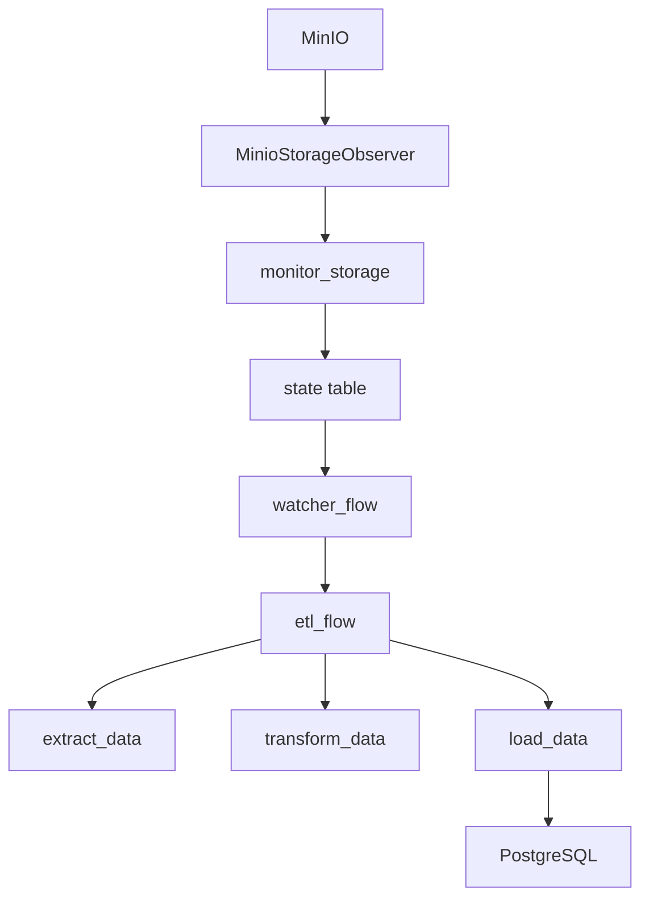

# Proyecto ETL con MinIO, PostgreSQL y Prefect

Este proyecto implementa un flujo ETL (Extract, Transform, Load) que permite cargar datos desde archivos almacenados en MinIO hacia una base de datos PostgreSQL. Está diseñado para ser modular, escalable y fácil de configurar mediante variables de entorno. La orquestación se realiza con Prefect 3.

## 📦 Descripción

El sistema permite:
- Monitorear archivos en MinIO.
- Detectar cambios y registrar su estado.
- Ejecutar flujos ETL para procesar archivos pendientes.
- Transformar y limpiar datos.
- Cargar los datos en PostgreSQL.
- Controlar el estado de cada archivo procesado.

## 🧱 Arquitectura




## 🧰 Requisitos del sistema

Para ejecutar este proyecto necesitas tener instalado:

- [Docker](https://www.docker.com/) y [Docker Compose](https://docs.docker.com/compose/)
- [Python 3.10+](https://www.python.org/downloads/)

También se recomienda tener:
- Git para clonar el repositorio
- Un editor como VSCode para desarrollo local

## ⚙️ Configuración

Las variables de entorno se definen en `settings.py` y se pueden cargar desde un archivo `.env`.

### Variables requeridas

#### MinIO
- `MINIO_ENDPOINT`
- `MINIO_ACCESS_KEY`
- `MINIO_SECRET_KEY`
- `BUCKET`

#### PostgreSQL
- `DATABASE_HOST`
- `DATABASE_PORT`
- `DATABASE_NAME`
- `DATABASE_USER`
- `DATABASE_PASSWORD`
- `DATABASE_SCHEMA`

## 📁 Estructura del Proyecto

```
prefect_flows/
├── tasks/
│   ├── extract.py
│   ├── transform.py
│   └── load.py
├── utils/
│   ├── minio_client.py
│   └── storage_observer.py
├── etl_flow.py
├── monitor_storage.py
└── watcher_flow.py
config/
└── settings.py
database/
├── db_state.py
└── db_product.py
etl_deployment.py
entrypoint.sh
Dockerfile
README.md
```

## 🧩 Módulos Clave

### `monitor_storage.py`
- Observa MinIO.
- Detecta archivos nuevos o modificados.
- Actualiza la tabla `state`.

### `watcher_flow.py`
- Revisa si hay archivos pendientes (`status = 'pending'`).
- Dispara el flujo ETL si corresponde.

### `etl_flow.py`
- Extrae, transforma y carga los archivos pendientes.
- Actualiza el estado a `ready` si el procesamiento fue exitoso.

### `extract.py`, `transform.py`, `load.py`
- Tareas de Prefect que implementan cada etapa del ETL.

### `db_state.py`
- Controla el estado de cada archivo.
- Permite reintentos, actualizaciones y seguimiento.

### `db_product.py`
- Crea tablas dinámicamente.
- Inserta datos con `COPY`.
- Cuenta registros.

### `minio_client.py` y `storage_observer.py`
- Cliente MinIO.
- Observador de almacenamiento con interfaz común.

### `etl_deployment.py`
- Despliega los flujos en Prefect:
  - `monitor_storage` (cada 60 segundos)
  - `watcher` (cada 5 minutos)
  - `etl_api_trigger` (manual o por trigger)

### `entrypoint.sh`
- Script de arranque que espera la Prefect API, crea el work pool y registra los deployments.

### `Dockerfile`
- Imagen basada en Python 3.12.
- Instala dependencias y configura Prefect.

## 🛠️ Requisitos

- Python 3.10+
- PostgreSQL
- MinIO
- Prefect 2.x
- Paquetes:
  - `pandas`
  - `psycopg[binary]`
  - `python-dotenv`
  - `prefect`
  - `minio`
  - `openpyxl`


## 🚀 Ejecución

1. Asegúrate de tener Docker y Docker Compose instalados.
2. Configura el archivo `.env` con tus credenciales si es necesario.
3. Ejecuta el siguiente comando para levantar todos los servicios:

```bash
docker-compose up --build
```

4. Verifica que Prefect Server esté disponible en [http://localhost:4200](http://localhost:4200).
5. El flujo `monitor_storage` se ejecutará cada 60 segundos y `watcher` cada 5 minutos.
6. Los archivos nuevos o modificados serán procesados automáticamente por el flujo ETL.

## 📌 Estado de Archivos

Cada archivo procesado se registra en la tabla `state`, con:
- `file_path`, `etag`, `last_modified`
- `status`: `pending`, `extracting`, `transforming`, `loading`, `ready`
- `retries`: número de intentos
- `last_checked`, `created_at`, `updated_at`
